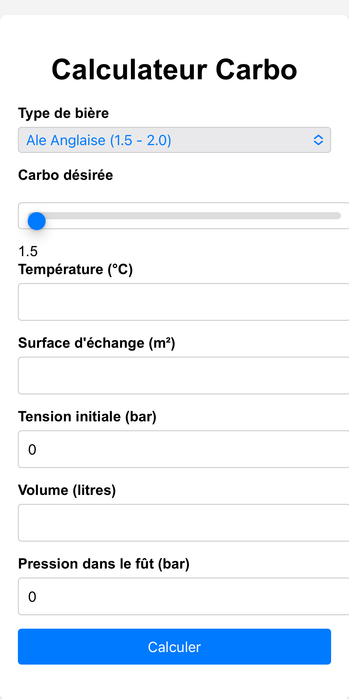

# CO2 Carbonation Calculator

A web app to calculate CO2 equilibrium pressure and carbonation time for homebrewed beer.

## Why

When I started kegging instead of bottling my beers I had to figure out which pressure to apply to my keg in order to get a good beer. I used [this spreadsheet](https://www.brassageamateur.com/forum/download/file.php?id=296) from the [brassageamateur.com](https://www.brassageamateur.com/forum/viewtopic.php?f=56&t=7652&p=84017&hilit=boite+%C3%A0+outils+carbo#p84017) community. It works but I need to have a computer. So I decided to port it to a web tool.

## What it does

- Calculates CO2 equilibrium pressure based on temperature and desired carbonation
- Estimates carbonation time based on keg parameters
- Available as a PWA — add it to your home screen from your browser

<p align="center">
  
</p>

## Usage

1. Select your beer style and adjust the desired carbonation level
2. Enter temperature, volume, exchange surface, initial pressure and keg pressure
3. Hit **Calculate**

## Run locally

```sh
git clone https://github.com/Nem0oo/Calculateur-carbo.git
cd Calculateur-carbo
```

Serve the files in `code/` with any web server. See [ExempleDocker.md](ExempleDocker.md) for a Docker example.

---

MIT License — Nem0oo
